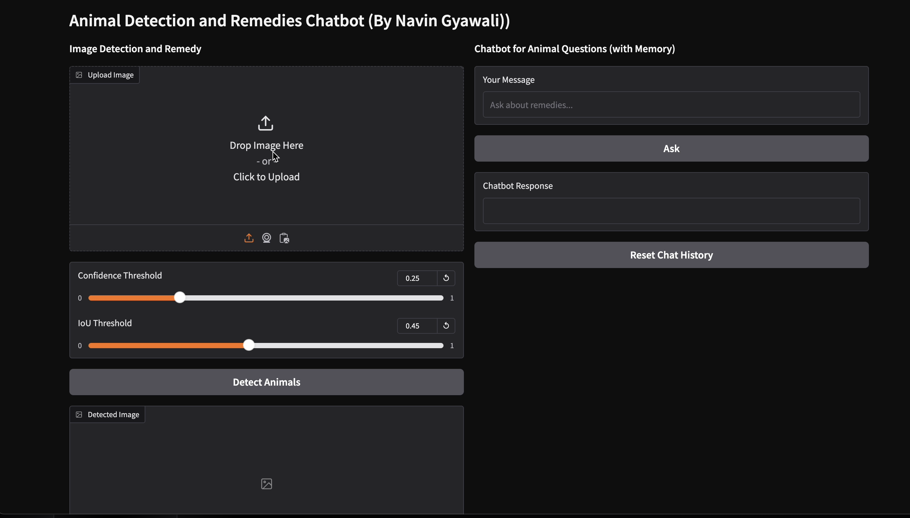
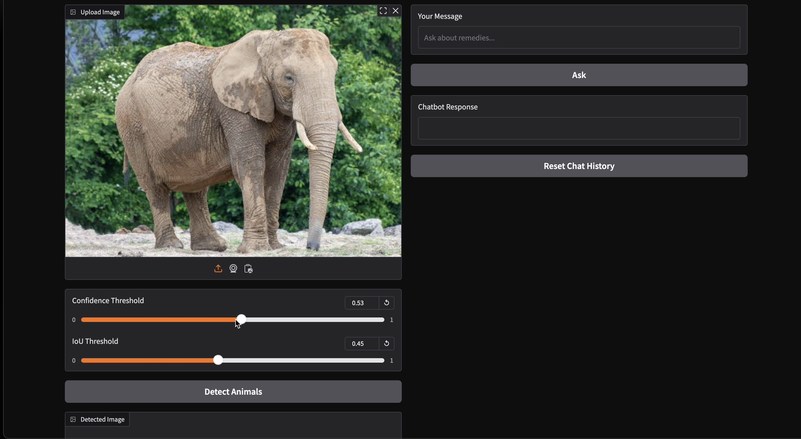
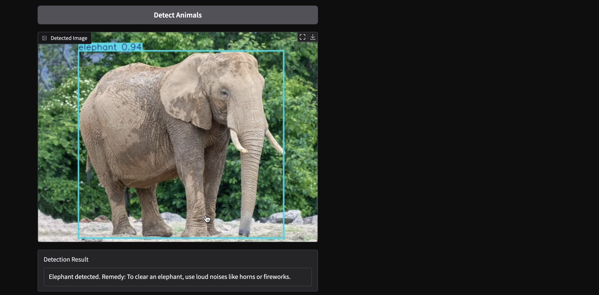
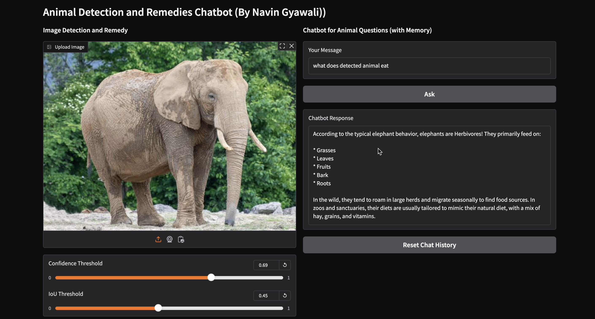

# Animal Detection and Remedy System with ChatBot

This project focuses on the development of an **Animal Detection and Remedy System**, integrated with a **ChatBot**, designed to identify specific animals and suggest appropriate remedies based on the detection.

## Key Features

### Animal Detection
- Using **YOLO (You Only Look Once)** object detection model, the system can identify various animals in real-time.
- The model has been trained to detect the following animals:
  - Elephants
  - Cows
  - Buffaloes
  - Snakes
  - Goats
  - Dogs

### Remedy Suggestions
- Once an animal is detected, the system provides suggestions for handling or addressing any issues that the animal may be facing, such as first aid tips or environmental considerations.

### Integrated ChatBot
- A conversational **ChatBot** helps users interact with the system. Users can ask about animal-related issues, and the ChatBot will offer advice based on the animal detection and any pre-defined remedies.

### Real-Time Detection and Interaction
- The system processes images or video streams, detecting animals in real-time and responding with suitable guidance and remedies.

## Technologies Used
- **YOLO v8n** model with custom dataset for object detection
- **GROQ api** for interactive chatbot
- **Gradio** for building the User interface
- **Python** based overall project

## Project Use Cases
- This project is designed to help in situations where animals need immediate attention or where there is a risk of conflict between animals and human populations, such as:
  - **Agriculture**: Identifying animals that may be causing damage to crops.
  - **Conservation**: Assisting wildlife protection efforts by detecting endangered species.
  - **Urban Areas**: Addressing human-animal conflicts in urban environments.

## Installation

1. Clone the repository:
   ```bash
   git clone https://github.com/navin123456789/Animal-Detection-and-Remedy-System.git
   cd Animal-Detection-and-Remedy-System

# Animal Detection and Remedy System with ChatBot


This project focuses on the development of an **Animal Detection and Remedy System**, integrated with a **ChatBot**, designed to identify specific animals and suggest appropriate remedies based on the detection.

## Key Features

### Animal Detection
- Using **YOLO (You Only Look Once)** object detection model, the system can identify various animals in real-time.
- The model has been trained to detect the following animals:
  - Elephants
  - Cows
  - Buffaloes
  - Snakes
  - Goats
  - Dogs

### Remedy Suggestions
- Once an animal is detected, the system provides suggestions for handling or addressing any issues that the animal may be facing, such as first aid tips or environmental considerations.

### Integrated ChatBot
- A conversational **ChatBot** helps users interact with the system. Users can ask about animal-related issues, and the ChatBot will offer advice based on the animal detection and any pre-defined remedies.

### Real-Time Detection and Interaction
- The system processes images or video streams, detecting animals in real-time and responding with suitable guidance and remedies.

## Technologies Used
- **YOLOv4/YOLOv5** model with custom dataset for object detection
- **TensorFlow/Keras** for deep learning
- **Gradio** for building the ChatBot interface
- **Python** based overall project

## Project Use Cases
- This project is designed to help in situations where animals need immediate attention or where there is a risk of conflict between animals and human populations, such as:
  - **Agriculture**: Identifying animals that may be causing damage to crops.
  - **Conservation**: Assisting wildlife protection efforts by detecting endangered species.
  - **Urban Areas**: Addressing human-animal conflicts in urban environments.

## Installation

1. Clone the repository:
   ```bash
   git clone https://github.com/yourusername/Animal-Detection-and-Remedy-System.git
   cd Animal-Detection-and-Remedy-System
# Animal Detection and Remedy System with ChatBot


This project focuses on the development of an **Animal Detection and Remedy System**, integrated with a **ChatBot**, designed to identify specific animals and suggest appropriate remedies based on the detection.

## Key Features

### Animal Detection
- Using **YOLO (You Only Look Once)** object detection model, the system can identify various animals in real-time.
- The model has been trained to detect the following animals:
  - Elephants
  - Cows
  - Buffaloes
  - Snakes
  - Goats
  - Dogs

### Remedy Suggestions
- Once an animal is detected, the system provides suggestions for handling or addressing any issues that the animal may be facing, such as first aid tips or environmental considerations.

### Integrated ChatBot
- A conversational **ChatBot** helps users interact with the system. Users can ask about animal-related issues, and the ChatBot will offer advice based on the animal detection and any pre-defined remedies.

### Real-Time Detection and Interaction
- The system processes images or video streams, detecting animals in real-time and responding with suitable guidance and remedies.

## Technologies Used
- **YOLOv4/YOLOv5** model with custom dataset for object detection
- **TensorFlow/Keras** for deep learning
- **Gradio** for building the ChatBot interface
- **Python** based overall project

## Project Use Cases
- This project is designed to help in situations where animals need immediate attention or where there is a risk of conflict between animals and human populations, such as:
  - **Agriculture**: Identifying animals that may be causing damage to crops.
  - **Conservation**: Assisting wildlife protection efforts by detecting endangered species.
  - **Urban Areas**: Addressing human-animal conflicts in urban environments.

## Installation

1. Clone the repository:
   ```bash
   git clone https://github.com/yourusername/Animal-Detection-and-Remedy-System.git
   cd Animal-Detection-and-Remedy-System
# Animal Detection and Remedy System with ChatBot


This project focuses on the development of an **Animal Detection and Remedy System**, integrated with a **ChatBot**, designed to identify specific animals and suggest appropriate remedies based on the detection.

## Key Features

### Animal Detection
- Using **YOLO (You Only Look Once)** object detection model, the system can identify various animals in real-time.
- The model has been trained to detect the following animals:
  - Elephants
  - Cows
  - Buffaloes
  - Snakes
  - Goats
  - Dogs

### Remedy Suggestions
- Once an animal is detected, the system provides suggestions for handling or addressing any issues that the animal may be facing, such as first aid tips or environmental considerations.

### Integrated ChatBot
- A conversational **ChatBot** helps users interact with the system. Users can ask about animal-related issues, and the ChatBot will offer advice based on the animal detection and any pre-defined remedies.

### Real-Time Detection and Interaction
- The system processes images or video streams, detecting animals in real-time and responding with suitable guidance and remedies.

## Technologies Used
- **YOLOv4/YOLOv5** model with custom dataset for object detection
- **TensorFlow/Keras** for deep learning
- **Gradio** for building the ChatBot interface
- **Python** based overall project

## Project Use Cases
- This project is designed to help in situations where animals need immediate attention or where there is a risk of conflict between animals and human populations, such as:
  - **Agriculture**: Identifying animals that may be causing damage to crops.
  - **Conservation**: Assisting wildlife protection efforts by detecting endangered species.
  - **Urban Areas**: Addressing human-animal conflicts in urban environments.

## Installation

1. Clone the repository:
   ```bash
   git clone https://github.com/yourusername/Animal-Detection-and-Remedy-System.git
   cd Animal-Detection-and-Remedy-System
   
## Demo of Animal Detection and Remedy System with ChatBot





